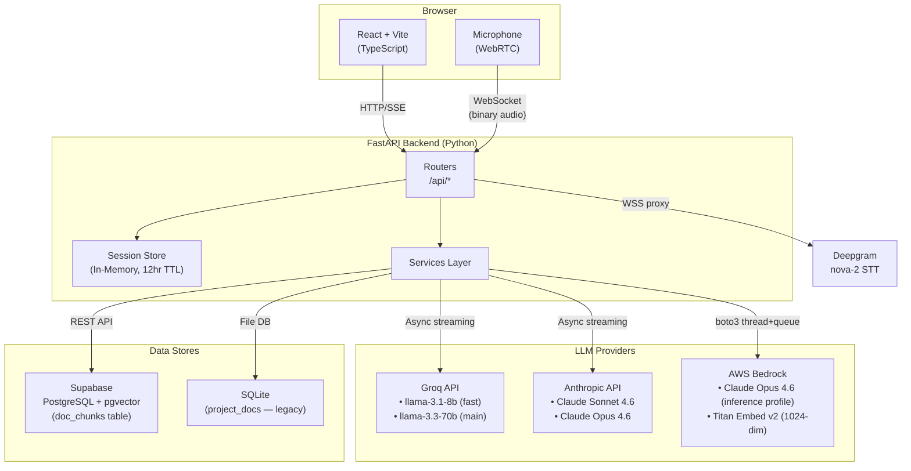
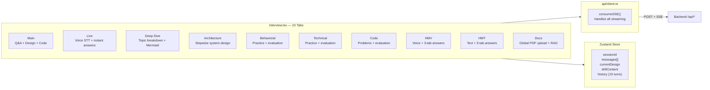
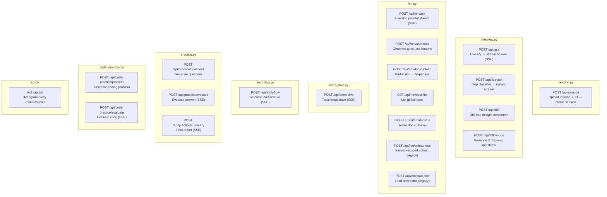
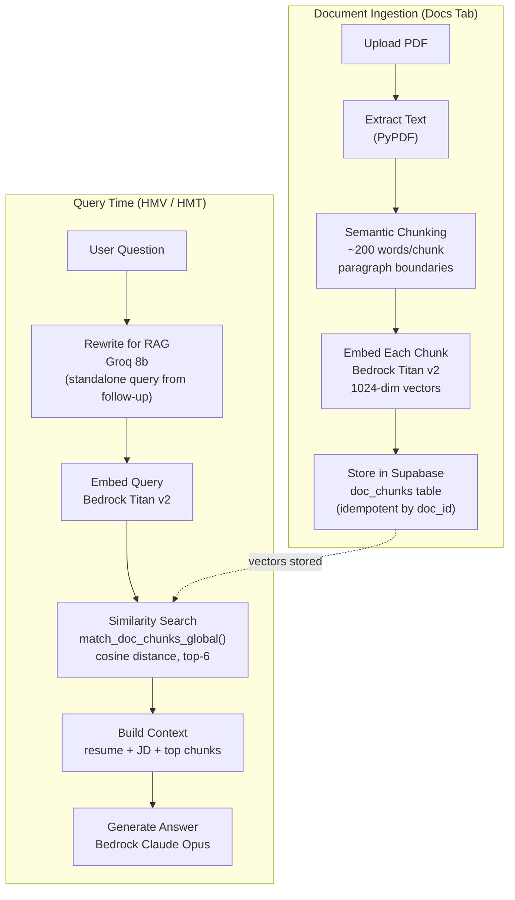
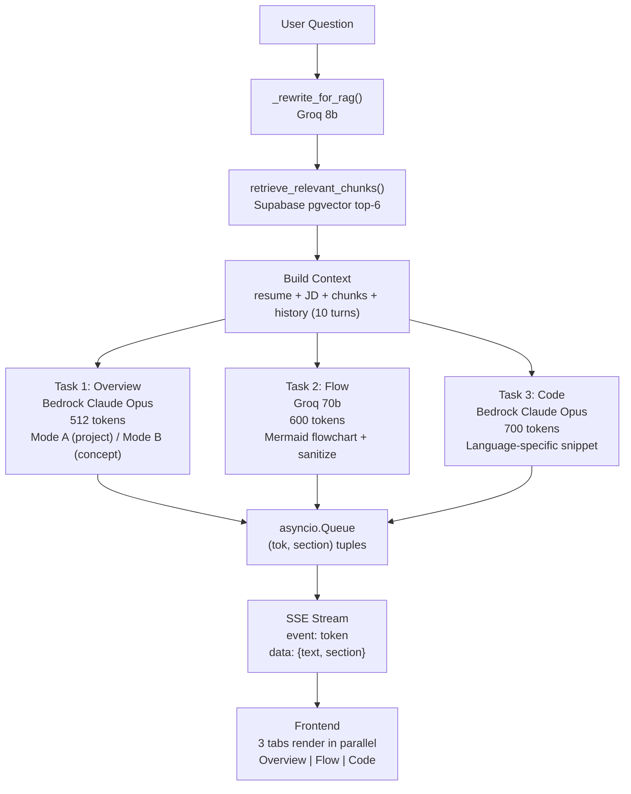
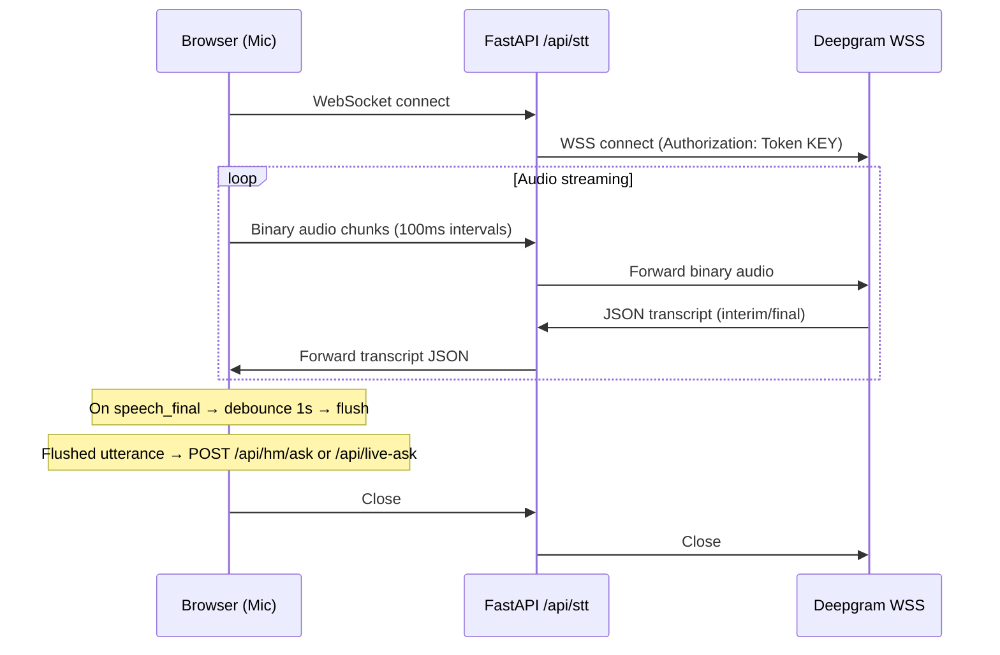
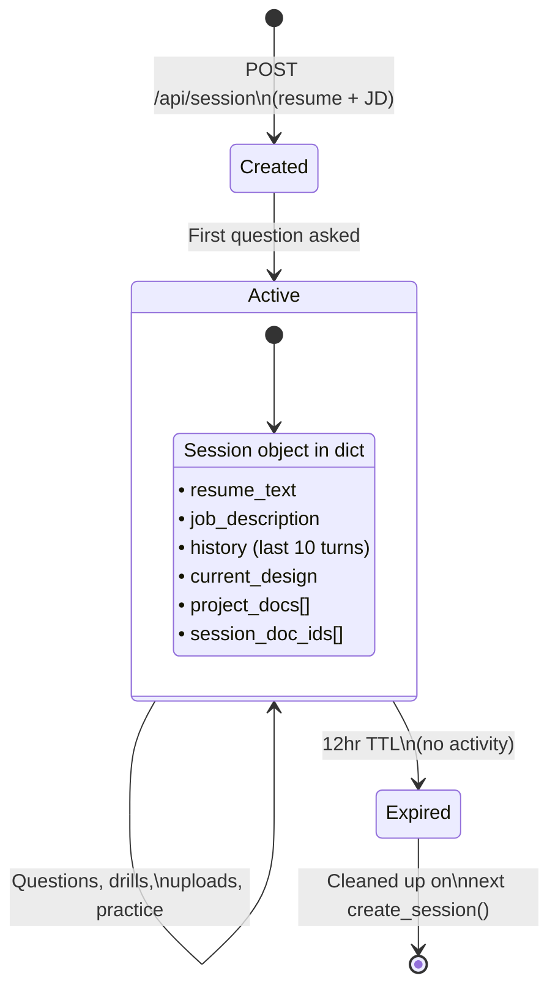
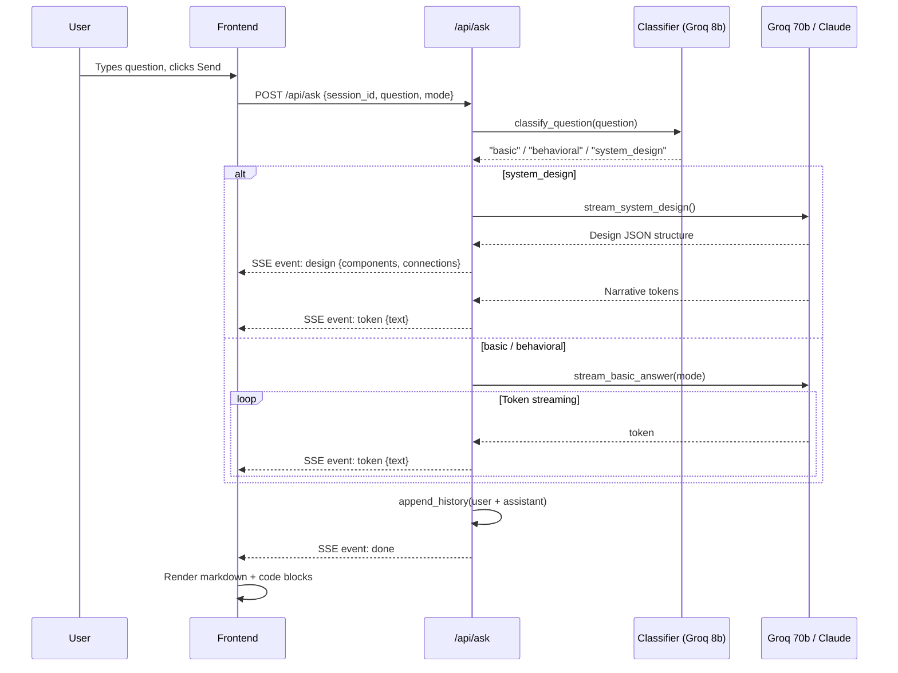

# The Panel — Architecture

## High-Level System Overview



---

## Frontend — Tab Architecture



---

## Backend — Router & Endpoint Map



---

## Model Routing

| Model | Provider | Use Cases |
|-------|----------|-----------|
| `llama-3.1-8b-instant` | Groq | Question classification, RAG query rewrite, follow-up generation |
| `llama-3.3-70b-versatile` | Groq | Main Q&A, system design (JSON + narrative), shortcuts, Mermaid flow diagrams, practice question generation, coding problem generation |
| `claude-sonnet-4-6` | Anthropic (direct) | Drill-down (depth=1), deep dives, architecture flows, practice evaluation, code evaluation |
| `claude-opus-4-6` | Anthropic (direct) | Deep drill (depth >= 2) |
| `us.anthropic.claude-opus-4-6-v1` | AWS Bedrock | HM overview section, HM code section (parallel streaming via thread+queue) |
| `amazon.titan-embed-text-v2:0` | AWS Bedrock | Document chunk embeddings (1024-dim vectors) |
| `nova-2` | Deepgram | Speech-to-text (Live + HMV voice panels) |

---

## RAG Pipeline



### Supabase Schema

```sql
-- Table
CREATE TABLE doc_chunks (
    id          UUID PRIMARY KEY DEFAULT gen_random_uuid(),
    doc_id      TEXT NOT NULL,
    filename    TEXT NOT NULL,
    chunk_index INTEGER NOT NULL,
    chunk_text  TEXT NOT NULL,
    embedding   vector(1024),
    created_at  TIMESTAMPTZ DEFAULT NOW()
);

-- Global similarity search function
CREATE OR REPLACE FUNCTION match_doc_chunks_global(
    query_embedding vector(1024),
    match_count     int DEFAULT 6
)
RETURNS TABLE (chunk_text text, doc_id text, filename text, similarity float)
LANGUAGE plpgsql AS $$
BEGIN
    RETURN QUERY
    SELECT dc.chunk_text, dc.doc_id, dc.filename,
           1 - (dc.embedding <=> query_embedding) AS similarity
    FROM doc_chunks dc
    ORDER BY dc.embedding <=> query_embedding
    LIMIT match_count;
END;
$$;
```

---

## HM Mode — 3-Section Parallel Streaming



---

## STT WebSocket Proxy



---

## Session Lifecycle



---

## Data Flow — Main Interview Q&A



---

## File Structure

```
thepanel/
├── frontend/
│   ├── src/
│   │   ├── pages/
│   │   │   └── Interview.tsx          # Main page, 10-tab layout
│   │   ├── components/
│   │   │   ├── QueryBar.tsx           # Question input + mode buttons
│   │   │   ├── AnswersPanel.tsx       # Streamed Q&A display
│   │   │   ├── DesignPanel.tsx        # System design canvas
│   │   │   ├── DrillDrawer.tsx        # Component drill-down
│   │   │   ├── CodePanel.tsx          # Code viewer
│   │   │   ├── LiveVoicePanel.tsx     # STT + live answers
│   │   │   ├── DeepDivePanel.tsx      # Topic deep dive
│   │   │   ├── ArchFlowPanel.tsx      # Architecture flow
│   │   │   ├── PracticePanel.tsx      # Behavioral/technical practice
│   │   │   ├── CodePracticePanel.tsx  # Coding problems
│   │   │   ├── HMVoicePanel.tsx       # HM voice mode
│   │   │   ├── HMTextPanel.tsx        # HM text mode
│   │   │   ├── HMAnswerCard.tsx       # 3-tab answer card
│   │   │   ├── ProjectDocsPanel.tsx   # Global doc management
│   │   │   └── AudioVisualizer.tsx    # Mic visualizer
│   │   ├── api/
│   │   │   └── client.ts             # All API calls + SSE consumer
│   │   └── store/
│   │       └── sessionStore.ts        # Zustand state management
│   └── vite.config.ts                 # Dev server + proxy to :8001
│
├── backend/
│   ├── main.py                        # FastAPI app + CORS + router mounts
│   ├── config.py                      # Settings (API keys, model IDs)
│   ├── models/
│   │   └── schemas.py                 # Pydantic models
│   ├── routers/
│   │   ├── session.py                 # POST /api/session
│   │   ├── interview.py               # /ask, /live-ask, /drill, /follow-ups
│   │   ├── hm.py                      # /hm/* (hiring manager + global docs)
│   │   ├── deep_dive.py               # /deep-dive
│   │   ├── arch_flow.py               # /arch-flow
│   │   ├── practice.py                # /practice/*
│   │   ├── code_practice.py           # /code-practice/*
│   │   └── stt.py                     # WS /api/stt (Deepgram proxy)
│   └── services/
│       ├── session_store.py           # In-memory session management
│       ├── question_classifier.py     # Groq-based question classification
│       ├── groq_client.py             # Groq streaming (Q&A, design, follow-ups)
│       ├── anthropic_client.py        # Claude streaming (drill, deep dive)
│       ├── hm_client.py               # Bedrock streaming + RAG + 3-section parallel
│       ├── practice_client.py         # Practice question gen + evaluation
│       ├── code_practice_client.py    # Code problem gen + evaluation
│       ├── deep_dive_client.py        # Deep dive streaming
│       ├── arch_flow_client.py        # Architecture flow streaming
│       ├── vector_store.py            # Supabase pgvector (chunk, embed, search)
│       ├── embeddings.py              # Bedrock Titan embed wrapper
│       ├── doc_store.py               # SQLite doc persistence (legacy)
│       └── pdf_parser.py              # PyPDF text extraction
│
└── ARCHITECTURE.md                    # ← You are here
```
